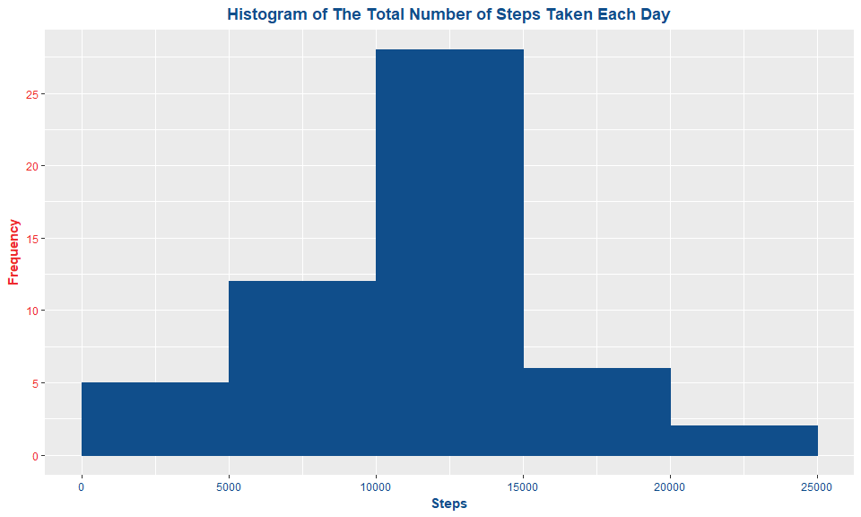

# Reproducible Research: Peer Assessment 1

## Activity Scope

- This activity depends on the existence of a dataset called **Activity Monitoring Data**. if you don't have one, you could download it from [here](https://d396qusza40orc.cloudfront.net/repdata%2Fdata%2Factivity.zip). meanwhile, this **R Markdown** handles this issues for you, ***Just Enjoy :)***.


## Loading and preprocessing the data


```r
# Importing the required dataset

dataset <- read.csv(file = "activity.csv")

# Dataset sample preview

head(dataset)
```

```
##   steps       date interval
## 1    NA 2012-10-01        0
## 2    NA 2012-10-01        5
## 3    NA 2012-10-01       10
## 4    NA 2012-10-01       15
## 5    NA 2012-10-01       20
## 6    NA 2012-10-01       25
```

## What is mean total number of steps taken per day?

**1. aggregating the total number of steps per day**


```r
# Calculating the total number of steps taken per day

total_steps_pd <- aggregate(steps ~ date, subset(dataset, steps != "NA"), sum)

# Dataset sample preview

head(total_steps_pd)
```

```
##         date steps
## 1 2012-10-02   126
## 2 2012-10-03 11352
## 3 2012-10-04 12116
## 4 2012-10-05 13294
## 5 2012-10-06 15420
## 6 2012-10-07 11015
```

**2. Histogram of the total number of steps taken each day**


```r
library(ggplot2)

ggplot(total_steps_pd, aes(date, steps, fill = steps)) +  
geom_histogram(aes(fill = steps), position = "dodge", stat="identity") +  
theme(axis.title.x = element_text(colour = "dodgerblue4", face = "bold"),
      axis.text.x = element_text(angle = 90, hjust = 1, vjust = 0.5, colour = "dodgerblue4"), 
      axis.title.y = element_text(colour = "firebrick2", face = "bold"),
      axis.text.y = element_text(colour = "firebrick2"),
      legend.text = element_text(colour = "firebrick2"),
      legend.title = element_text(colour = "dodgerblue4", face = "bold"),
      plot.title = element_text(hjust = 0.5, colour = "dodgerblue4", face = "bold")) +  
xlab("Days") +  
ylab("Total Steps Per Day") +  
labs(fill = "Steps") +  
ggtitle("Histogram of The Total Number of Steps Taken Each Day")
```

<!-- -->

**3. Answring the question of What is mean total number of steps taken per day?**  


```r
bmean <- as.integer(round(mean(total_steps_pd$steps),0))
bmedian <- as.integer(round(median(total_steps_pd$steps),0))
```

+  **So, the Mean is : 10766, and the Median is : 10765**

## What is the average daily activity pattern?

**1. Calculating the average number of steps taken across all days grouped by *the 5-minute interval***


```r
# Calculating the average number of steps taken across all days by interval

avg_steps_pi <- aggregate(steps ~ interval, subset(dataset, steps != "NA"), mean)

# Dataset sample preview

head(avg_steps_pi)
```

```
##   interval     steps
## 1        0 1.7169811
## 2        5 0.3396226
## 3       10 0.1320755
## 4       15 0.1509434
## 5       20 0.0754717
## 6       25 2.0943396
```

**2. Time series plot of the average number for all intervals**


```r
ggplot(avg_steps_pi, aes(interval, steps, fill = steps)) +  
geom_line(color="royalblue4", size = 1, aes(fill = steps), position = "dodge", stat="identity") +  
theme(axis.title.x = element_text(colour = "dodgerblue4", face = "bold"),
      axis.text.x = element_text(colour = "dodgerblue4"), 
      axis.title.y = element_text(colour = "firebrick2", face = "bold"),
      axis.text.y = element_text(colour = "firebrick2"),
      plot.title = element_text(hjust = 0.5, colour = "dodgerblue4", face = "bold")) +  
xlab("Intervals") +  
ylab("Average Steps Across All Days") +  
ggtitle("Time Series Plot of The Average Number of All Intervals Across All Days")
```

<!-- -->

**3. Answring the question of Which 5-minute interval, on average across all the days in the dataset, contains the maximum number of steps?**  


```r
maxInterval = subset(avg_steps_pi, steps == max(avg_steps_pi$steps))[,1]
```

+ **So, the 5-minute interval contains the maximum number of steps is : 835.** 

## Imputing missing values

**1. Calculating the total number of missing values in the Activity Monitoring Data :**  


```r
nas_ds <- sum(is.na(dataset$steps))
```

+ **So, there is 2304 missing values in the Activity Monitoring Data.** 

**2. Devising a strategy for filling in all of the missing values in the Activity Monitoring Data :**  


```r
# Creating new dataset to decide which strategy to apply, other words, filling NAs with the mean/median for that day, or the mean for that 5-minute interval

chk_dataset <- data.frame(date = dataset$date, 
                          interval = dataset$interval, 
                          is_na = is.na(dataset$steps),
                          not_na = !is.na(dataset$steps))

# Dataset sample preview

head(chk_dataset)
```

```
##         date interval is_na not_na
## 1 2012-10-01        0  TRUE  FALSE
## 2 2012-10-01        5  TRUE  FALSE
## 3 2012-10-01       10  TRUE  FALSE
## 4 2012-10-01       15  TRUE  FALSE
## 5 2012-10-01       20  TRUE  FALSE
## 6 2012-10-01       25  TRUE  FALSE
```

+ **a) Summarizing By Date :**  


```r
library(plyr)

# Creating a new aggregated dataset grouped by Date

chk_by_date <- ddply(chk_dataset, .(date), summarise, is_na = sum(is_na), not_na = sum(not_na))

chk_by_date_no <- nrow(chk_by_date)

# Dataset sample preview

head(chk_by_date)
```

```
##         date is_na not_na
## 1 2012-10-01   288      0
## 2 2012-10-02     0    288
## 3 2012-10-03     0    288
## 4 2012-10-04     0    288
## 5 2012-10-05     0    288
## 6 2012-10-06     0    288
```

+ **b) Challenging Date :**  


```r
# Identifying the weight of NAs values across all days

strategyBD <- nrow(subset(chk_by_date, is_na != 0 & not_na != 0))
```

+ **So, There is 0 rows out of 61 total rows in the aggregated dataset grouped by Date that we could replace NAs with.**

+ **c) Summarizing By Interval :**  


```r
# Creating a new aggregated dataset grouped by Interval

chk_by_interval <- ddply(chk_dataset, .(interval), summarise, is_na = sum(is_na), not_na = sum(not_na))

chk_by_interval_no <- nrow(chk_by_interval)

# Dataset sample preview

head(chk_by_interval)
```

```
##   interval is_na not_na
## 1        0     8     53
## 2        5     8     53
## 3       10     8     53
## 4       15     8     53
## 5       20     8     53
## 6       25     8     53
```

+ **d) Challenging Interval :**  


```r
# Identifying the weight of NAs values across all days

strategyBI <- nrow(subset(chk_by_interval, is_na != 0 & not_na != 0))
```

+ **So, There is 288 rows out of 288 total rows in the aggregated dataset grouped by Interval that we could replace NAs with.**

**Obviously from the above, we tend to fill in all of the missing values in the Activity Monitoring Data using the mean for each 5-minute interval across all the days.**  

**3. Creating a new dataset that is equal to the original dataset but with the missing data filled in :**  


```r
# Merging the original dataset with the dataset containing the average number for all intervals

filled_dataset <- merge(dataset, avg_steps_pi, by = "interval", suffixes = c("_org","_avg"))

# Creating new column holds the original steps value and used to replace NAs in it to help tracing the changes

filled_dataset$steps <- filled_dataset$steps_org

# Filling in the NAs with its intervals' mean 

filled_dataset[is.na(filled_dataset$steps), "steps"] <- filled_dataset[is.na(filled_dataset$steps), "steps_avg"]

# Arranging and reordering the new dataset

filled_dataset <- filled_dataset[order(filled_dataset$date,filled_dataset$interval), c("steps","date","interval","steps_org","steps_avg")]

row.names(filled_dataset) <- c(1:nrow(filled_dataset))

# Dataset sample preview

head(subset(filled_dataset, is.na(steps_org)), 10)
```

```
##        steps       date interval steps_org steps_avg
## 1  1.7169811 2012-10-01        0        NA 1.7169811
## 2  0.3396226 2012-10-01        5        NA 0.3396226
## 3  0.1320755 2012-10-01       10        NA 0.1320755
## 4  0.1509434 2012-10-01       15        NA 0.1509434
## 5  0.0754717 2012-10-01       20        NA 0.0754717
## 6  2.0943396 2012-10-01       25        NA 2.0943396
## 7  0.5283019 2012-10-01       30        NA 0.5283019
## 8  0.8679245 2012-10-01       35        NA 0.8679245
## 9  0.0000000 2012-10-01       40        NA 0.0000000
## 10 1.4716981 2012-10-01       45        NA 1.4716981
```

**4. Making a histogram of the total number of steps taken each day after filling the NAs across al days :** 

+ **a) Aggregating the total number of steps per day**


```r
# Calculating the total number of steps taken per day

total_fill_steps_pd <- aggregate(steps ~ date, subset(filled_dataset, steps != "NA"), sum)

# Dataset sample preview

head(total_fill_steps_pd)
```

```
##         date    steps
## 1 2012-10-01 10766.19
## 2 2012-10-02   126.00
## 3 2012-10-03 11352.00
## 4 2012-10-04 12116.00
## 5 2012-10-05 13294.00
## 6 2012-10-06 15420.00
```

+ **b) Creating a new dataset contains all the total steps per day before and after filling NAs :**


```r
# Adding new column to each dataset to identify the source on the plot

total_steps_pd$type <- c("Before Filling NAs")

total_fill_steps_pd$type <- c("After Filling NAs")

# Calculating the total number of steps taken per day

total_steps_pd_ba <- rbind(total_steps_pd, total_fill_steps_pd)

# Dataset sample preview

head(total_steps_pd_ba)
```

```
##         date steps               type
## 1 2012-10-02   126 Before Filling NAs
## 2 2012-10-03 11352 Before Filling NAs
## 3 2012-10-04 12116 Before Filling NAs
## 4 2012-10-05 13294 Before Filling NAs
## 5 2012-10-06 15420 Before Filling NAs
## 6 2012-10-07 11015 Before Filling NAs
```

+ **c) Histogram of the total number of steps taken each day before and after filling in NAs :**


```r
ggplot(total_steps_pd_ba, aes(date, steps, fill = type)) +  
geom_histogram(aes(fill = type),position = "dodge", stat="identity") +  
theme(axis.title.x = element_text(colour = "dodgerblue4", face = "bold"),
      axis.text.x = element_text(angle = 90, hjust = 1, vjust = 0.5, colour = "dodgerblue4"), 
      axis.title.y = element_text(colour = "firebrick2", face = "bold"),
      axis.text.y = element_text(colour = "firebrick2"),
      legend.title = element_text(colour = "dodgerblue4", face = "bold"),
      legend.text = element_text(colour = "firebrick2"),
      plot.title = element_text(hjust = 0.5, colour = "dodgerblue4", face = "bold")) + 
scale_fill_manual(values = c("dodgerblue4","steelblue3")) +  
xlab("Days") +  
ylab("Total Steps Per Day") +  
labs(fill = "Steps") +  
ggtitle("Histogram of The Total Number of Steps Taken Each Day Before/After Filling NAs")
```

<!-- -->

+ **d) Answring the question of Do these values differ from the estimates from the first part of the assignment?**  


```r
amean <- as.integer(round(mean(total_fill_steps_pd$steps),0))
amedian <- as.integer(round(median(total_fill_steps_pd$steps),0))
asum <- as.integer(round(sum(total_fill_steps_pd$steps),0))
```

**So, the mean before filling NAs was : 10766, while after filling NAs become : 10766,**  

**While, the median before filling NAs was : 10765, and after filling NAs become : 10766**  

+ **Almostly, There is no difference in the mean and median total number of steps taken per day before and after filling in the NAs.**  

+ **e) Answring the question of What is the impact of imputing missing data on the estimates of the total daily number of steps?**  


```r
bsum <- as.integer(round(sum(total_steps_pd$steps),0))
asum <- as.integer(round(sum(total_fill_steps_pd$steps),0))
vsum <- as.integer(round(100 - ((bsum / asum) * 100),0))
```

**So, the total daily number of steps before filling NAs was : 570608, while after filling NAs become : 656738,**  

+ **Obviously, There is increase in the total number of steps taken per day before and after filling in the NAs by : 13%.** 

## Are there differences in activity patterns between weekdays and weekends?

**1. Creating a new factor variable in the dataset with two levels - "weekday" and "weekend" indicating whether a given date is a weekday or weekend day :**  


```r
# Creating vector holds the weekend days

weekends <- c('Saturday', 'Sunday')

# Creating a factor to identify the day type and assign it to a new column in the filled dataset

filled_dataset$day_type <- factor((weekdays(as.Date(filled_dataset$date)) %in% weekends), 
                                  levels = c(TRUE, FALSE), 
                                  labels = c("weekend","weekday"))

# Dataset sample preview

head(filled_dataset, 10)
```

```
##        steps       date interval steps_org steps_avg day_type
## 1  1.7169811 2012-10-01        0        NA 1.7169811  weekday
## 2  0.3396226 2012-10-01        5        NA 0.3396226  weekday
## 3  0.1320755 2012-10-01       10        NA 0.1320755  weekday
## 4  0.1509434 2012-10-01       15        NA 0.1509434  weekday
## 5  0.0754717 2012-10-01       20        NA 0.0754717  weekday
## 6  2.0943396 2012-10-01       25        NA 2.0943396  weekday
## 7  0.5283019 2012-10-01       30        NA 0.5283019  weekday
## 8  0.8679245 2012-10-01       35        NA 0.8679245  weekday
## 9  0.0000000 2012-10-01       40        NA 0.0000000  weekday
## 10 1.4716981 2012-10-01       45        NA 1.4716981  weekday
```

**2. Creating a new dataset containing the 5-minute interval and the average number of steps taken, averaged across all weekday days or weekend days :** 


```r
# Creating a new aggregated dataset grouped by interval across all weekdays and weekends

avgIntByDT <- ddply(filled_dataset, .(interval, day_type), summarise, steps = mean(steps))

# Dataset sample preview

head(avgIntByDT, 10)
```

```
##    interval day_type       steps
## 1         0  weekend 0.214622642
## 2         0  weekday 2.251153040
## 3         5  weekend 0.042452830
## 4         5  weekday 0.445283019
## 5        10  weekend 0.016509434
## 6        10  weekday 0.173165618
## 7        15  weekend 0.018867925
## 8        15  weekday 0.197903564
## 9        20  weekend 0.009433962
## 10       20  weekday 0.098951782
```

**3. Making a panel plot containing a time series plot (type = "l") of the 5-minute interval (x-axis) and the average number of steps taken, averaged across all day types (y-axis)**  


```r
ggplot(avgIntByDT, aes(interval, steps, fill = steps)) +  
geom_line(color="royalblue4", size = 1, aes(fill = steps), position = "dodge", stat="identity") +  
theme(axis.title.x = element_text(colour = "dodgerblue4", face = "bold"),
      axis.text.x = element_text(colour = "dodgerblue4"), 
      axis.title.y = element_text(colour = "firebrick2", face = "bold"),
      axis.text.y = element_text(colour = "firebrick2"),
      plot.title = element_text(hjust = 0.5, colour = "dodgerblue4", face = "bold")) +  
facet_wrap( ~ day_type, nrow = 2) +  
xlab("Intervals") +  
ylab("Average Steps Across All Day Types") +  
ggtitle("Time Series Plot of The Average Number of All Intervals Across All Day Types")
```

<!-- -->
  
  
  
  
  
